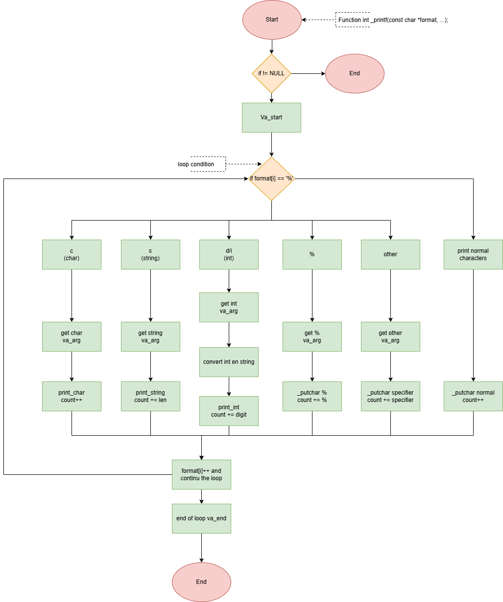

# 🖨️ Custom _printf Function

A custom re-implementation of the standard C printf function, developed as part of the Holberton School Low-Level Programming curriculum.

# ✨ Description
**_printf** is a fully custom version of the C standard printf.
It prints formatted output to stdout using only the low-level system call write(), avoiding the standard I/O library.

* This project explores:
* Parsing format strings
* Handling variadic arguments (va_list)
* Implementing number → string conversion
* Building a minimal formatting engine in C
* Reproducing core behaviors of printf

It is designed as an educational deep-dive into how formatted output works under the hood.

# 🛠️ Compilation

The code have been compiled with the command 
```c
$ gcc -Wall -Werror -Wextra -pedantic -std=gnu89 -Wno-format _printf
```

# 📋 Requirements
This project follows the standard Holberton C project constraints, including:

- Developed and tested on **Ubuntu 20.04 LTS**

- Compiled with **GCC** and strict flags (-Wall -Werror -Wextra -pedantic -std=gnu89)

- Git-based version control with meaningful commits

- Code written following the **Betty coding style**

- No use of global variables

- Maximum **5 functions per .c** file

- All prototypes stored in **main.h** (with include guards)

- A complete **README** at project root

# 📦 Supported Format Specifiers

| Specifier | Meaning                 |
|----------|--------------------------|
| `%c`     | Print a single character |
| `%s`     | Print a string           |
| `%%`     | Print the % symbol       |
| `%d`     | Print a signed integer   |
| `%i`     | Same as `%d`             |

Additional specifiers (`%u`, `%x`, `%o`, etc.) may be implemented later.

# 🧪 Exemples
**Basic usage**
```c
#include "main.h"

int main(void)
{
    _printf("Hello %s!\n", "world");
    _printf("Character: %c\n", 'A');
    _printf("Percent: %%\n");
    _printf("Number: %d\n", 42);
    return (0);
}
```

# ✅ Tests performed

The following test cases were manually verified:
``` 
    len = _printf("Let's try to printf a simple sentence.\n");
    len2 = printf("Let's try to printf a simple sentence.\n");
    _printf("Length:[%d, %i]\n", len, len);
    printf("Length:[%d, %i]\n", len2, len2);
    _printf("Negative:[%d]\n", -762534);
    printf("Negative:[%d]\n", -762534);
    _printf("Character:[%c]\n", 'H');
    printf("Character:[%c]\n", 'H');
    _printf("String:[%s]\n", "I am a string !");
    printf("String:[%s]\n", "I am a string !");
    len = _printf("Percent:[%%]\n");
    len2 = printf("Percent:[%%]\n");
    _printf("Len:[%d]\n", len);
    printf("Len:[%d]\n", len2);
```
The output was compared with the standard `printf` to ensure correctness.

Edge cases and additional specifiers (like `%u`, `%x`, etc.) will be tested in future updates.
   
# 📚 Manual Page
A man page is included in the repository.
To open it:
```
man ./man_3_printf
```
# 📁 Project Structure (optional section)
```
├── _printf.c
├── handle_formats.c
├── utils.c
├── man_3_printf
├── main.h
└── README.md

```
# 👥 Authors
Georgia Boulnois Gwendal Boisard and Fabien Cousinat Holberton, Actual Digital School

main
